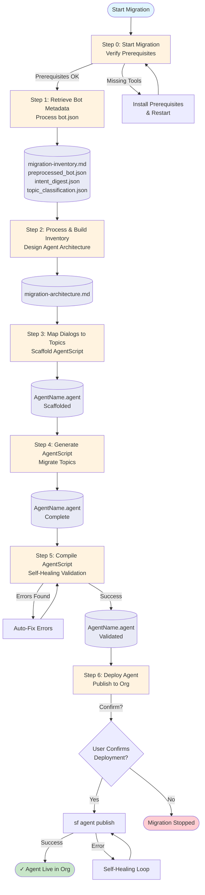

# Einstein Bot to NGA Agent Migration Pipeline

> Automated migration tool for converting Salesforce Einstein Bots to Next Generation AI (NGA) Agents using AgentScript format.

## Overview

This pipeline automates the migration of Einstein Bots to Salesforce NGA Agents through a 6-step process. It transforms legacy bot metadata (dialogs, intents, invocations) into modern AgentScript format, preserving all functionality while leveraging AI-guided reasoning.

**Key Features:**
- Automated bot metadata parsing and transformation
- Intelligent dialog-to-topic mapping
- Self-healing compilation with automatic error resolution
- Safe deployment with mandatory human-in-the-loop confirmation
- Resume-from-failure capabilities at any pipeline step

## Prerequisites

Before starting a migration, ensure you have the following installed:

- **Node.js** (v18+) - Required for Salesforce CLI
- **Salesforce CLI** (`sf`) - For org authentication and deployment
- **uv** - Python package manager (auto-manages Python dependencies)
- **Network Access** - Connection to Salesforce Nexus PyPI proxy

### Quick Installation

Install all prerequisites using the provided installation scripts:

**macOS/Linux:**
```bash
bash scripts/install-prerequisites.sh
```

**Windows (PowerShell):**
```powershell
powershell -ExecutionPolicy Bypass -File scripts/install-prerequisites.ps1
```

After installation, restart your terminal and authenticate to a Salesforce org:
```bash
sf org login web --instance-url <ORG_LOGIN_URL> --alias <CUSTOM_NAME>
```

**Example:**
```bash
sf org login web --instance-url https://orgfarm-7532d67587.test1.my.pc-rnd.salesforce.com/ --alias orgfarm-epic
```

## Migration Pipeline

The migration follows a structured 6-step pipeline:



### Detailed Step Breakdown

### Step 0: Start Migration
**Skill:** `00-start-migration`

Entry point that verifies prerequisites and explains the migration process.

- Checks all required tools are installed
- Validates Salesforce org authentication
- Tests compiler dependency access
- Provides pipeline overview

### Step 1: Retrieve Bot Metadata
**Skill:** `01-retrieve-bots-metadata`

Processes Einstein Bot JSON export and generates comprehensive inventory.

**Outputs:**
- `migration-inventory.md` - Complete bot structure analysis
- `data/preprocessed_bot.json` - Structured bot data
- `data/intent_digest.json` - Intent summaries
- `data/topic_classification.json` - Preliminary topic groupings

**Extracts:**
- Dialog structure (dialogs, dialog groups, bot steps)
- Actions and invocations (Apex, Flow, API, Standard Invocable Actions)
- ML intents and utterances
- Navigation flows (Redirect, Call, Intent_Redirect)

### Step 2: Process and Build Inventory
**Skill:** `02-process-and-build-inventory`

Analyzes bot structure and designs optimal NGA Agent architecture.

**Outputs:**
- `migration-architecture.md` - Target architecture plan

**Maps:**
- Dialogs → Topics (grouped by entity, variables, intents)
- Bot Steps → Reasoning (deterministic → AI-guided)
- Invocations → Actions (preserving targets exactly)
- Intents → Topic Router (dedicated intent routing)
- Navigation → Transitions (Redirect/Call/Intent_Redirect)

### Step 3: Map Dialogs/Actions to Topics
**Skill:** `03-map-dialogs-actions-to-topics`

Creates directory structure and scaffolds the `.agent` file.

**Outputs:**
- `force-app/main/default/aiAuthoringBundles/<AgentName>/`
- `<AgentName>.agent` with foundational blocks:
  - `config:` - Agent metadata
  - `variables:` - Mutable and linked variables
  - `system:` - Welcome message and global instructions
  - `start_agent:` - Entry point topic

### Step 4: Generate AgentScript
**Skill:** `04-generate-agentscript`

Core migration engine that transforms bot dialogs into AgentScript topics.

**Converts:**
- Message steps → Reasoning instructions (pipe text)
- Invocation steps → Action calls with slot filling
- Variable operations → Assignments or action parameters
- Navigation steps → Topic transitions
- Conditional logic → `if/else` blocks or `available when` guards

**Output:** Complete `.agent` file with all topic blocks

### Step 5: Compile AgentScript
**Skill:** `05-compile-agentscript`

Validates the AgentScript in a self-healing loop.

- Runs local compiler with automatic error diagnosis
- Applies targeted fixes for common issues
- Loops until compilation succeeds (max 30 iterations)
- Distinguishes real errors from library warnings

**Output:** Validated `.agent` file ready for deployment

### Step 6: Deploy Agent to Org
**Skill:** `06-deploy-agent-to-org`

Deploys the compiled agent to Salesforce org with human confirmation.

- Displays full org details (ID, username, instance URL, type)
- Requires explicit YES/NO confirmation
- Publishes via `sf agent publish authoring-bundle`
- Self-healing publish loop on failures (max 15 retries)

**Output:** Live `aiAuthoringBundle` agent in Salesforce org

## Quick Start

1. **Place your bot metadata** in `data/bot.json`
2. **Start the migration:**
   ```
   Ask Claude: "Start the bot migration"
   ```
   or directly invoke: `/00-start-migration`
3. **Follow the prompts** at each checkpoint
4. **Review and confirm** architecture design
5. **Confirm deployment** to target org

## Project Structure

```
bot-to-agent-migration-dev/
├── .claude/
│   └── skills/              # Pipeline step implementations
│       ├── 00-start-migration/
│       ├── 01-retrieve-bots-metadata/
│       ├── 02-process-and-build-inventory/
│       ├── 03-map-dialogs-actions-to-topics/
│       ├── 04-generate-agentscript/
│       ├── 05-compile-agentscript/
│       └── 06-deploy-agent-to-org/
├── customers/              # Customer-specific bot metadata
├── data/                   # Intermediate artifacts
│   ├── generated/         # Generated AgentScript files
│   └── sf-cli/            # Salesforce CLI package directory
├── docs/                   # Documentation
│   ├── PIPELINE.md        # Detailed pipeline reference
│   ├── TROUBLESHOOTING.md # Common issues and solutions
│   └── CONTRIBUTING.md    # Contribution guidelines
├── scripts/               # Installation and utility scripts
└── force-app/             # Generated Salesforce metadata
    └── main/default/
        └── aiAuthoringBundles/
```

## Intermediate Artifacts

| File | Produced By | Consumed By | Purpose |
|------|------------|-------------|---------|
| `migration-inventory.md` | Step 1 | Steps 2, 4 | Complete structural inventory |
| `migration-architecture.md` | Step 2 | Steps 3, 4, 5, 6 | Target architecture plan |
| `<AgentName>.agent` | Steps 3-5 | Step 6 | AgentScript source file |

## Pipeline Recovery

Resume from any step if interrupted:

| Resume From | Required Artifact | Skill to Invoke |
|-------------|------------------|-----------------|
| Step 0 | _(none)_ | `00-start-migration` |
| Step 1 | _(none)_ | `01-retrieve-bots-metadata` |
| Step 2 | `migration-inventory.md` | `02-process-and-build-inventory` |
| Step 3 | `migration-architecture.md` | `03-map-dialogs-actions-to-topics` |
| Step 4 | Scaffolded `.agent` file | `04-generate-agentscript` |
| Step 5 | Complete `.agent` file | `05-compile-agentscript` |
| Step 6 | Compiled `.agent` file | `06-deploy-agent-to-org` |

## Manual Compilation

Test your AgentScript locally at any time:

```bash
uv run --refresh --native-tls .claude/skills/00-start-migration/scripts/compile_agentscript.py path/to/YourAgent.agent
```

**Compiler Outcomes:**

| Output | Meaning |
|--------|---------|
| `Successfully compiled Agent Script.` | No errors |
| `Successfully compiled Agent Script (library warnings present...)` | No errors in your code (library warnings are informational) |
| `Parse errors in ...` / `Compile errors in ...` | Real errors requiring fixes |

**Note:** The local compiler catches most issues, but `sf agent publish` is the authoritative validator.

## Documentation

- **[PIPELINE.md](docs/PIPELINE.md)** - Detailed step-by-step pipeline reference
- **[TROUBLESHOOTING.md](docs/TROUBLESHOOTING.md)** - Common issues and solutions
- **[CONTRIBUTING.md](docs/CONTRIBUTING.md)** - Contribution guidelines
- **[SECURITY.md](SECURITY.md)** - Security policies and reporting

## Bot-Specific Transformations

### Dialog Step Mappings

| Bot Step Type | AgentScript Pattern |
|--------------|-------------------|
| Message | Reasoning instructions (pipe text) |
| Invocation | Action calls with slot filling |
| Variable Operation | Assignments or action parameters |
| Navigation | Topic transitions |
| Wait | Implicit in reasoning loop |
| Conditional | `if/else` or `available when` guards |

### Variable Mappings

| Bot Variable Type | AgentScript Type |
|------------------|-----------------|
| Conversation Variable | `mutable` |
| Context Variable | `linked` (with source:) |
| Action Output | `mutable` (when used downstream) |

### Navigation Mappings

| Bot Navigation Type | AgentScript Pattern |
|--------------------|-------------------|
| Redirect | `after_reasoning` transition |
| Call | `before_reasoning` or inline action |
| Intent_Redirect | Transition to `topic_router` |

## Support

For issues, questions, or contributions:
- Open an issue in the repository
- Refer to [TROUBLESHOOTING.md](docs/TROUBLESHOOTING.md)
- Review detailed documentation in [docs/](docs/)

## License

Copyright © 2026 Salesforce. All rights reserved.

---

**Version:** 2.0-bot  
**Last Updated:** April 2026
